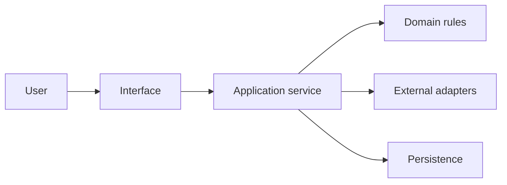

# Architecture

Status: Draft

## Context

`[DESCRIBE_USERS_EXTERNAL_SYSTEMS_AND_TRUST_BOUNDARIES]`

## Components

| Component | Responsibility | Must not do |
|---|---|---|
| `[COMPONENT]` | `[RESPONSIBILITY]` | `[BOUNDARY]` |

## Data flow

Replace this illustrative diagram with the real project flow.

## Trust boundaries

- Untrusted inputs:
- Privileged operations:
- User-owned data:
- External services and binaries:
- Redaction and logging boundary:

## Platform boundaries

| Concern | Shared policy | Platform-specific adapter |
|---|---|---|
| Process lifecycle | `[POLICY]` | `[IMPLEMENTATION]` |
| Paths and filenames | `[POLICY]` | `[IMPLEMENTATION]` |
| Packaging | `[POLICY]` | `[IMPLEMENTATION]` |

## Recovery invariants

- `[DATA_OR_STATE_THAT_MUST_SURVIVE_FAILURE]`
- `[ATOMICITY_OR_NO_OVERWRITE_RULE]`
- `[CANCELLATION_AND_LATE_RESPONSE_RULE]`
